# Event Ticketing API — Entity-Relationship Diagram

**Version:** 1.1
**Date:** 2026-09-09
**Derived from:** `event-ticketing-api-resources.md` v1.5 and `openapi.yaml` v1.3.0-draft

This is the full v1 data model — every resource identified in
`resources.md` plus the schema shapes now defined in `openapi.yaml`
(organization application/approval, combinable org roles, promo codes,
waitlists, resale, refunds/payouts, ticket templates, notifications,
disputes, audit log). Attribute lists are trimmed to the fields that
matter for understanding relationships and key business rules — not a
full column-by-column schema.

## Audit column policy

Matches the codebase's existing `Auditable` convention (every current
entity — `Event`, `User` — carries `created_at`/`created_by`/
`updated_at`/`updated_by`/`deleted_at`):

- **Managed resources** an organizer/admin actively authors and edits get
  the **full set**: `created_at`, `created_by`, `updated_at`, `updated_by`,
  `deleted_at` (soft delete) — `User`, `Organization`, `Venue`, `Event`,
  `SeatMap`, `TicketType`, `PromoCode`, `RefundPolicy`, `ResalePolicy`,
  `TicketTemplate`.
- **Transactional/status-bearing records** get `created_at` + `updated_at`
  (status changes over time) but no `deleted_at` — cancelling/voiding one
  of these is a status transition, not a deletion, and re-attributing
  "who last edited it" doesn't fit a financial/ticketing record. Adds
  `updated_by` only where an admin actively edits it after creation
  (`Dispute`). Entities here: `Order`, `Ticket`, `Payment`, `Refund`,
  `Payout`, `ResaleListing`, `Cart`, `Seat`, `CheckInConfig`,
  `ScannerDevice`, `Dispute`.
- **Immutable, append-only historical/log records** get only a single
  creation timestamp (often an existing domain-specific field like
  `scanned_at` or `transferred_at`) and nothing else — adding
  `updated_at`/`updated_by`/`deleted_at` to a historical fact would
  undermine the reason it exists. Entities here: `CheckInRecord`,
  `FallbackScanRecord`, `TicketTransfer`, `TicketArtifact`,
  `AuditLogEntry`, `Notification`, `OrganizationMember`, `CartItem`,
  `WaitlistEntry`.

```mermaid
erDiagram
    %% ── Identity & Access ─────────────────────────────────────
    User ||--o{ OrganizationMember : "holds roles via"
    Organization ||--o{ OrganizationMember : "has"

    User {
        uuid id PK
        string name
        string email
        boolean is_admin
        datetime created_at
        uuid created_by FK
        datetime updated_at
        uuid updated_by FK
        datetime deleted_at "nullable, soft delete"
    }

    Organization {
        uuid id PK
        string name
        enum status "pending / approved / rejected"
        json documents
        uuid owner_id FK "null until approved"
        datetime created_at
        uuid created_by FK "the applicant"
        datetime updated_at
        uuid updated_by FK
        datetime deleted_at "nullable, soft delete"
    }

    OrganizationMember {
        uuid user_id FK
        uuid organization_id FK
        enum roles "owner / organizer / check_in_staff, combinable"
        datetime assigned_at "creation timestamp"
    }

    %% ── Event & Catalog ────────────────────────────────────────
    Organization ||--o{ Venue : owns
    Organization ||--o{ Event : owns
    Venue ||--o{ Event : "hosts (optional)"
    Event ||--o| SeatMap : has
    SeatMap ||--o{ Seat : contains
    Event ||--o{ TicketType : offers

    Venue {
        uuid id PK
        uuid organization_id FK
        string name
        string address "nullable, virtual venues"
        float latitude "nullable"
        float longitude "nullable"
        datetime created_at
        uuid created_by FK
        datetime updated_at
        uuid updated_by FK
        datetime deleted_at "nullable, soft delete"
    }

    Event {
        uuid id PK
        uuid organization_id FK
        uuid venue_id FK "nullable, fully virtual event"
        string title
        string category
        datetime start_at
        datetime end_at
        string timezone
        enum status "draft/published/on_sale/sold_out/cancelled/completed"
        string ticket_number_prefix "random 3-letter, reserved unique platform-wide"
        datetime created_at
        uuid created_by FK
        datetime updated_at
        uuid updated_by FK
        datetime deleted_at "nullable, soft delete"
    }

    SeatMap {
        uuid id PK
        uuid event_id FK
        datetime created_at
        uuid created_by FK
        datetime updated_at
        uuid updated_by FK
        datetime deleted_at "nullable, soft delete"
    }

    Seat {
        uuid id PK
        uuid seat_map_id FK
        string section
        string row
        string seat_number
        enum status "available/held/sold"
        datetime created_at
        datetime updated_at
    }

    TicketType {
        uuid id PK
        uuid event_id FK
        string name
        enum kind "general_admission / reserved_seating"
        money price
        int quantity_total
        int quantity_available
        datetime sale_start_at
        datetime sale_end_at
        int max_per_order
        datetime created_at
        uuid created_by FK
        datetime updated_at
        uuid updated_by FK
        datetime deleted_at "nullable, soft delete"
    }

    %% ── Inventory & Cart ───────────────────────────────────────
    User ||--o{ Cart : owns
    Cart ||--o{ CartItem : contains
    CartItem }o--|| TicketType : selects
    CartItem }o--o| Seat : "reserves (seating events)"
    Event ||--o{ PromoCode : offers
    Cart }o--o| PromoCode : "may apply"

    Cart {
        uuid id PK
        uuid buyer_id FK
        money total
        datetime created_at
        datetime updated_at
    }

    CartItem {
        uuid id PK
        uuid cart_id FK
        uuid ticket_type_id FK
        uuid seat_id FK "nullable"
        int quantity
        datetime hold_expires_at "temporary hold, 10-15 min default"
        datetime created_at "creation timestamp"
    }

    PromoCode {
        uuid id PK
        uuid event_id FK
        string code
        enum discount_type "percentage / fixed"
        number discount_value
        int usage_limit_total "nullable"
        int usage_limit_per_buyer "nullable"
        datetime valid_from
        datetime valid_until
        datetime created_at
        uuid created_by FK
        datetime updated_at
        uuid updated_by FK
        datetime deleted_at "nullable, soft delete"
    }

    %% ── Commerce ───────────────────────────────────────────────
    User ||--o{ Order : places
    Order ||--o{ Payment : "attempts"
    Order ||--o{ Ticket : issues
    Order ||--o{ Refund : "may have"
    Event ||--o| RefundPolicy : has
    Organization ||--o{ Payout : receives

    Order {
        uuid id PK
        uuid buyer_id FK
        enum payee_type "organization / user (resale)"
        uuid payee_id FK
        enum status "pending/paid/cancelled/refunded/partially_refunded"
        string promo_code "nullable"
        money total
        uuid created_by FK
        datetime created_at
        datetime updated_at "status transitions"
    }

    Payment {
        uuid id PK
        uuid order_id FK
        string gateway_ref
        money amount
        enum status
        datetime created_at
        datetime updated_at "status transitions"
    }

    RefundPolicy {
        uuid event_id FK
        enum rule_type "refundable_until_n_days / no_refunds / custom"
        int days_before_event "nullable"
        datetime created_at
        uuid created_by FK
        datetime updated_at
        uuid updated_by FK
        datetime deleted_at "nullable, soft delete"
    }

    Refund {
        uuid id PK
        uuid order_id FK
        money amount
        string reason
        uuid initiated_by FK "creator"
        enum status "pending/completed/failed"
        datetime created_at
        datetime updated_at "status transitions"
    }

    Payout {
        uuid id PK
        uuid organization_id FK
        money gross
        money fees
        money net
        date period_start
        date period_end
        enum status "scheduled/paid/failed"
        datetime created_at
        datetime updated_at "status transitions"
    }

    %% ── Ticketing ──────────────────────────────────────────────
    TicketType ||--o{ Ticket : "issues instances of"
    Ticket }o--o| Seat : occupies
    Ticket ||--o{ TicketTransfer : "ownership history"
    Ticket ||--o| ResaleListing : "may be listed"
    Event ||--o| ResalePolicy : has
    ResaleListing ||--o| Order : "resolves into (on sale)"
    Event ||--o{ TicketTemplate : defines
    TicketTemplate ||--o{ TicketArtifact : renders
    Ticket ||--o{ TicketArtifact : "rendered as"
    Event ||--o{ WaitlistEntry : "sells out into"
    User ||--o{ WaitlistEntry : joins

    Ticket {
        uuid id PK
        uuid order_id FK
        uuid ticket_type_id FK
        uuid seat_id FK "nullable"
        uuid owner_id FK
        string ticket_number "PREFIX-XXXXXX, globally unique"
        string credential "signed QR/barcode, never returned raw via API reads"
        enum status "valid/used/transferred/refunded/cancelled"
        datetime created_at
        datetime updated_at "status transitions"
    }

    TicketTemplate {
        uuid id PK
        uuid event_id FK
        uuid ticket_type_id FK "nullable"
        enum format "physical / digital"
        json branding
        datetime created_at
        uuid created_by FK
        datetime updated_at
        uuid updated_by FK
        datetime deleted_at "nullable, soft delete"
    }

    TicketArtifact {
        uuid id PK
        uuid ticket_id FK
        enum format "physical / digital"
        string file_ref
        datetime created_at "render timestamp; a template change produces a new artifact, not an update"
    }

    TicketTransfer {
        uuid id PK
        uuid ticket_id FK
        uuid from_user_id FK
        uuid to_user_id FK
        enum source "direct_transfer / resale"
        datetime transferred_at "creation timestamp"
    }

    ResalePolicy {
        uuid event_id FK
        boolean enabled
        enum price_cap_rule "face_value / face_value_plus_fee / none"
        datetime created_at
        uuid created_by FK
        datetime updated_at
        uuid updated_by FK
    }

    ResaleListing {
        uuid id PK
        uuid ticket_id FK
        uuid seller_id FK "creator"
        money asking_price
        enum status "active/sold/cancelled/expired"
        uuid buyer_order_id FK "nullable, set once sold"
        datetime listed_at "creation timestamp"
        datetime resolved_at "nullable"
        datetime updated_at "status transitions"
    }

    WaitlistEntry {
        uuid id PK
        uuid event_id FK
        uuid ticket_type_id FK "nullable"
        uuid user_id FK "creator"
        int position
        datetime notified_at "nullable"
        datetime offer_expires_at "nullable"
        datetime created_at "join timestamp"
    }

    %% ── Check-in & Scanning ────────────────────────────────────
    Event ||--o| CheckInConfig : has
    Event ||--o{ ScannerDevice : authorizes
    ScannerDevice ||--o{ CheckInRecord : produces
    Event ||--o{ FallbackScanRecord : "(pure_offline only)"
    FallbackScanRecord ||--o| CheckInRecord : "reconciles into"
    Ticket ||--o{ CheckInRecord : "scanned into"

    CheckInConfig {
        uuid event_id FK
        enum mode "standard / pure_offline"
        int offline_fallback_expiry_seconds "default 300"
        datetime created_at
        datetime updated_at
        uuid updated_by FK "organizer who last changed mode"
    }

    ScannerDevice {
        uuid id PK
        uuid event_id FK
        string device_label
        enum status "active / revoked"
        datetime created_at
        uuid created_by FK "organizer who authorized it"
        datetime updated_at
        uuid updated_by FK
    }

    FallbackScanRecord {
        uuid id PK
        uuid event_id FK
        string raw_credential
        datetime captured_at "creation timestamp"
        datetime synced_at "nullable"
        uuid reconciled_ticket_id FK "nullable"
    }

    CheckInRecord {
        uuid id PK
        uuid ticket_id FK
        enum source_type "scanner_device / reconciled_fallback"
        uuid source_id FK
        enum result "valid/duplicate/invalid/wrong_event"
        datetime scanned_at "creation timestamp"
    }

    %% ── Engagement & Admin ─────────────────────────────────────
    User ||--o{ Notification : receives
    User ||--o{ Dispute : raises
    Order ||--o| Dispute : "may be disputed"
    Ticket ||--o| Dispute : "may be disputed"
    User ||--o{ AuditLogEntry : "acts as actor"

    Notification {
        uuid id PK
        uuid user_id FK
        enum type "order_confirmation / payment_receipt / ... "
        enum channel "email/sms/push"
        enum status "pending/sent/failed"
        datetime sent_at "nullable"
        datetime created_at "triggered timestamp"
    }

    Dispute {
        uuid id PK
        uuid order_id FK "nullable"
        uuid ticket_id FK "nullable"
        uuid raised_by FK "creator"
        enum status "open/investigating/resolved/dismissed"
        string resolution "nullable"
        datetime created_at
        datetime updated_at "status/resolution changes"
        uuid updated_by FK "admin who last acted on it"
    }

    AuditLogEntry {
        uuid id PK
        uuid actor_id FK
        string action
        string target_type "nullable"
        uuid target_id FK "nullable"
        datetime created_at "the audit timestamp itself — immutable, never updated"
    }
```

## Notes on choices made in this diagram

- **`OrganizationMember.roles` is a set, not a single value** — an
  owner/organizer/check_in_staff assignment is additive per
  `BR-AUTH-007`/`BR-AUTH-008`; one row per `(user_id, organization_id)`
  can carry multiple roles simultaneously rather than needing multiple
  rows.
- **`Organization.owner_id` is nullable** — it's only set once an
  application transitions from `pending` to `approved` (`BR-ORG-004`); a
  `pending`/`rejected` org has no owner.
- **`Hold` (from `resources.md`) is folded into `CartItem.hold_expires_at`**
  rather than modeled as its own entity — that's how it ended up shaped in
  `openapi.yaml`'s `CartItem` schema, so this diagram matches the actual
  spec rather than restating `resources.md`'s original separate-resource
  framing.
- **`Payment` and `TicketArtifact` have no dedicated CRUD endpoints** in
  `openapi.yaml` (payment happens inline during checkout; artifacts are
  generated on demand via `GET /tickets/{id}/artifact`) but are kept as
  distinct entities here since they're independently identifiable records
  per `resources.md`.
- **A `Ticket` has at most one *active* `ResaleListing`** at a time — shown
  as `||--o|` (zero-or-one), matching the "must resolve before relisting"
  rule in `resources.md` §3.
- **`AuditLogEntry` deliberately has no `updated_at`/`updated_by`/
  `deleted_at`** — see the audit column policy above; a mutable audit
  trail would defeat its own purpose.
